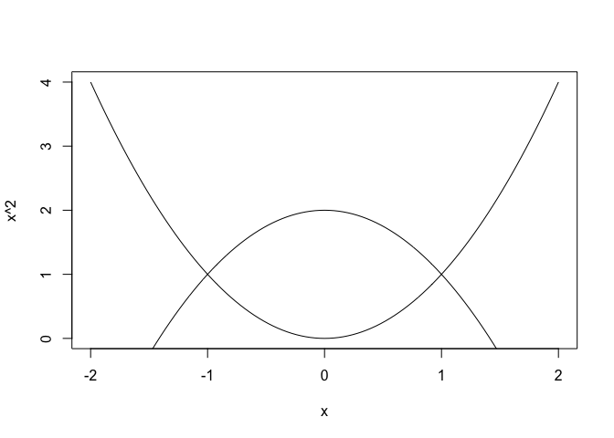

<!-- README.md is generated from README.Rmd. Please edit that file -->
algstat
=======

**algstat** is a collection of tools to help do algebraic statistics in R. Many (but not all) of the tools make use of back-end connections to software used in various math communities, such as [Macaulay2](http://www.math.uiuc.edu/Macaulay2/) (for algebraic computations), [Bertini](https://bertini.nd.edu) (for solving systems of polynomial equations), and [LattE](https://www.math.ucdavis.edu/~latte/) with [4ti2](http://www.4ti2.de) (for lattice problems and, in particular, the computation of Markov bases).

This brief intro is currently under construction.

Exact inference with log-linear models
======================================

*Note: this section assumes you have [LattE](https://www.math.ucdavis.edu/~latte/) and [4ti2](http://www.4ti2.de) installed and algstat has registered them.*

One of the most well-developed parts of the package allows users to perform (conditional) exact tests for log-linear models. There are several great references on the math behind this, such as [Diaconis and Sturmfels' original paper](http://projecteuclid.org/euclid.aos/1030563990), the [Lectures on Algebraic Statistics](http://smile.amazon.com/Lectures-Algebraic-Statistics-Oberwolfach-Seminars/dp/3764389044/ref=sr_1_1?ie=UTF8&qid=1430536908&sr=8-1&keywords=lectures+on+algebraic+statistics), and [Markov Bases in Algebraic Statistics](http://smile.amazon.com/Markov-Bases-Algebraic-Statistics-Springer/dp/1461437180/ref=sr_1_fkmr0_1?ie=UTF8&qid=1430536933&sr=8-1-fkmr0&keywords=aoki%2C+hada%2C+and+takemura), so we'll keep the technical discussion to a minimum.

### Fisher's exact test

We'll begin by doing Fisher's exact test on a built-in dataset called politics.

``` r
library(algstat)
# Loading required package: mpoly
# Loading required package: stringr
# Loading required package: latter
#   LattE found in /Applications/latte/dest/bin
#   4ti2 found in /Applications/latte/dest/bin
# Loading required package: m2r
# M2 found in /Applications/Macaulay2-1.9.2/bin
data(politics)
politics
#            Party
# Personality Democrat Republican
#   Introvert        3          7
#   Extrovert        6          4

fisher.test(politics)
# 
#   Fisher's Exact Test for Count Data
# 
# data:  politics
# p-value = 0.3698
# alternative hypothesis: true odds ratio is not equal to 1
# 95 percent confidence interval:
#  0.03005364 2.46429183
# sample estimates:
# odds ratio 
#   0.305415
```

Since the independence model is log-linear, this exact same procedure can be done with **algstat**. The go-to function here is `loglinear()` (formerly `hierarchical()`):

``` r
loglinear(~ Personality + Party, data = politics)
# Computing Markov moves (4ti2)...
# done.
# Running chain (C++)...
# done.
# Call:
# loglinear(model = ~Personality + Party, data = politics)
# 
# Fitting method:
# Iterative proportional fitting (with stats::loglin)
# 
# MCMC details:
# N = 10000 samples (after thinning), burn in = 1000, thinning = 10
# 
#       Distance   Stat     SE p.value     SE mid.p.value
#        P(samp)                0.3689 0.0048      0.22  
#    Pearson X^2 1.8182 0.0148  0.3689 0.0048      0.22  
# Likelihood G^2 1.848  0.0158  0.3689 0.0048      0.22  
#  Freeman-Tukey 1.8749 0.0169  0.3689 0.0048      0.22  
#   Cressie-Read 1.8247 0.015   0.3689 0.0048      0.22  
#     Neyman X^2 2.0089 0.0237  0.3689 0.0048      0.2932
```

Exact inference in algebraic statistics is done using MCMC to sample from the conditional distribution of the data given its sufficient statistics under the model. Consequently, the p-values estimated are only determined up to Monte Carlo error. The standard p-value is given under the column `p.value` in the row labeled `P(samp)`. The analogous asymptotic test can be done in either of two ways.

The first way uses the `loglin()` function from the **stats** package. It outputs the likelihood ratio statistic (`Likelihood G^2` in the output above) and Pearson's chi-squared statistic (`Pearson X^2` above), but you have to calculate the p-value yourself.

``` r
(loglinMod <- stats::loglin(politics, list(1, 2)))
# 2 iterations: deviation 0
# $lrt
# [1] 1.848033
# 
# $pearson
# [1] 1.818182
# 
# $df
# [1] 1
# 
# $margin
# $margin[[1]]
# [1] "Personality"
# 
# $margin[[2]]
# [1] "Party"
pchisq(loglinMod$pearson, df = 1, lower.tail = FALSE)
# [1] 0.1775299
```

The second way is the `loglm()` function in the **MASS** package, which is a nice wrapper of `loglin()` (in fact, **algstat**'s `loglinear()` function uses the IPF implementation from `loglin()`, although it doesn't need to). It's syntax looks identical to `loglinear()`'s above:

``` r
MASS::loglm(~ Personality + Party, data = politics)
# Call:
# MASS::loglm(formula = ~Personality + Party, data = politics)
# 
# Statistics:
#                       X^2 df  P(> X^2)
# Likelihood Ratio 1.848033  1 0.1740123
# Pearson          1.818182  1 0.1775299
```

### Fisher's exact test on RxC tables

Doing Fisher's exact test on larger problems is a significantly more complicated problem. The documentation for `fisher.test()` illustrates how it can be used on RxC tables in general, not just on 2x2 tables. Here's an example from its documentation drawn from Agresti (2002, p.57):

``` r
Job <- matrix(
  c(1,2,1,0, 3,3,6,1, 10,10,14,9, 6,7,12,11), nrow = 4, ncol = 4,
  dimnames = list(
    income = c("< 15k", "15-25k", "25-40k", "> 40k"),
    satisfaction = c("VeryD", "LittleD", "ModerateS", "VeryS")
  )
)

Job
#         satisfaction
# income   VeryD LittleD ModerateS VeryS
#   < 15k      1       3        10     6
#   15-25k     2       3        10     7
#   25-40k     1       6        14    12
#   > 40k      0       1         9    11

fisher.test(Job)
# 
#   Fisher's Exact Test for Count Data
# 
# data:  Job
# p-value = 0.7827
# alternative hypothesis: two.sided
```

And the **algstat** counterpart:

``` r
loglinear(~ income + satisfaction, data = Job)
# Care ought be taken with tables with sampling zeros to ensure the MLE exists.
# Computing Markov moves (4ti2)...
# done.
# Running chain (C++)...
# done.
# Call:
# loglinear(model = ~income + satisfaction, data = Job)
# 
# Fitting method:
# Iterative proportional fitting (with stats::loglin)
# 
# MCMC details:
# N = 10000 samples (after thinning), burn in = 1000, thinning = 10
# 
#       Distance   Stat     SE p.value     SE mid.p.value
#        P(samp)                0.7704 0.0042      0.7701
#    Pearson X^2 5.9655 0.0398  0.7576 0.0043      0.7576
# Likelihood G^2 6.7641 0.0426  0.763  0.0043      0.763 
#  Freeman-Tukey 8.6189 0.0579  0.7634 0.0042      0.7634
#   Cressie-Read 6.0752 0.0393  0.7589 0.0043      0.7589
#     Neyman X^2 6.2442 0.0484  0.5882 0.0049      0.5882
```

Note that the asymptotic test can be performed as well. The chi-square approximation is actually very good here:

``` r
MASS::loglm(~ income + satisfaction, data = Job)
# Call:
# MASS::loglm(formula = ~income + satisfaction, data = Job)
# 
# Statistics:
#                       X^2 df  P(> X^2)
# Likelihood Ratio 6.764053  9 0.6616696
# Pearson          5.965515  9 0.7433647
```

### Fisher's exact test on multi-way tables

`fisher.test()` does not generalize to multi-way tables and is prone to crashing even in large-celled two-way tables (see `?loglinear` for an example). Thus, the only way to do exact inference in multi-way tables (in general and in R) is to use an algebraic method. We'll illustrate this using the drugs dataset from `loglinear()`'s documentation, taken from Agresti (2002, p.322), on which we'll test the no-three-way interaction model:

``` r
data(drugs)
ftable(drugs)
#                     Alcohol Yes  No
# Cigarette Marijuana                
# Yes       Yes               991   3
#           No                538  43
# No        Yes                44   2
#           No                456 279

loglinear(subsets(1:3, 2), data = drugs)
# Computing Markov moves (4ti2)...
# done.
# Running chain (C++)...
# done.
# Call:
# loglinear(model = subsets(1:3, 2), data = drugs)
# 
# Fitting method:
# Iterative proportional fitting (with stats::loglin)
# 
# MCMC details:
# N = 10000 samples (after thinning), burn in = 1000, thinning = 10
# 
#       Distance   Stat     SE p.value     SE mid.p.value
#        P(samp)                0.5988 0.0049      0.4576
#    Pearson X^2 0.5279 0.0137  0.5988 0.0049      0.4576
# Likelihood G^2 0.4845 0.0149  0.5988 0.0049      0.4576
#  Freeman-Tukey 0.4672 0.0235  0.5988 0.0049      0.4576
#   Cressie-Read 0.512  0.0133  0.5988 0.0049      0.4576
#     Neyman X^2 0.4294 0.0131  0.5988 0.0049      0.4576
```

Note that here we've used the more concise syntax of facet specification. Doing the same with `loglm()` looks like this:

``` r
MASS::loglm(~ 1*2 + 2*3 + 1*3, data = drugs)
# Call:
# MASS::loglm(formula = ~1 * 2 + 2 * 3 + 1 * 3, data = drugs)
# 
# Statistics:
#                        X^2 df  P(> X^2)
# Likelihood Ratio 0.4845145  1 0.4863845
# Pearson          0.5279994  1 0.4674492
```

Statistical applications of LattE
=================================

*Note: this section assumes you have [LattE](https://www.math.ucdavis.edu/~latte/) and [4ti2](http://www.4ti2.de) installed and latter has registered it.*

Most [LattE](https://www.math.ucdavis.edu/~latte/) programs are available as functions in **latter**, which is imported by **algstat**. Checkout the readme for **latter** [here](https://github.com/dkahle/latter).

There are many statistical applications and potential applications of LattE in R. One example is found in the `count` program, implemented in `latter::count()`. `latter::count()` counts the number of integer points in a [convex polytope](https://en.wikipedia.org/wiki/Convex_polytope). This can be useful for counting the number of contingency tables with fixed marginals. **algstat** uses `latter::count()` in the `countTables()` function, which determines the number of contingency tables in the [fiber (isostatistical region)](http://en.wikipedia.org/wiki/Fiber_(mathematics)) of a table given an [exponential family model](http://en.wikipedia.org/wiki/Exponential_family).

``` r
countTables(politics) # the independence model is the default
# [1] 10
```

For example, we can determine the number of tables with the same row sums of `politics` as follows:

``` r
(A <- hmat(varlvls = c(2, 2), facets = 1:2)[1:2,])
#    11 12 21 22
# 1+  1  1  0  0
# 2+  0  0  1  1
countTables(politics, A)
# [1] 121
```

Numerically solving systems of polynomial equations
===================================================

*Note: this section assumes you have [Bertini](https://bertini.nd.edu) installed and algstat has registered it.*

**algstat** also provides back-end connections to [Bertini](https://bertini.nd.edu) to solve systems of polynomial equations. While this work is still being implemented, here's a peak at what it can currently do.

First, **algstat** can run raw Bertini programs using `bertini()`. It also has a nice print method to display the results. For example, here's how you would find the intersection of the line f(x) = x and the unit circle using Bertini:

``` r
code <- "
INPUT

variable_group x, y;
function f, g;

f = x^2 + y^2 - 1;
g = y - x;

END;
"
bertini(code)
# 2 solutions (x,y) found.  (2 real, 0 complex; 2 nonsingular, 0 singular.)
#     (-0.707,-0.707) (R)
#     ( 0.707, 0.707) (R)
```

Even better, **algstat** can team up with [**mpoly**](http://github.com/dkahle/mpoly) (working under the hood) to solve systems of polynomial equations using `polySolve()`:

``` r
curve(x^2, from = -2, to = 2, )
curve(2 - x^2, from = -2, to = 2, add = TRUE)
```



``` r
polySolve(c("y = x^2", "y = 2 - x^2"), varOrder = c("x", "y"))
# 2 solutions (x,y) found.  (2 real, 0 complex; 2 nonsingular, 0 singular.)
#     (-1,1) (R)
#     ( 1,1) (R)
```

Installation
============

Installing algstat
------------------

-   From CRAN: `install.packages("algstat")` (this is not up-to-date)

-   From Github (dev version):

    ``` r
    # install.packages("devtools")
    # install.packages("mpoly")
    devtools::install_github("dkahle/algstat")
    ```

Installing supporting software
------------------------------

Coming soon! See the links above for direct information.
